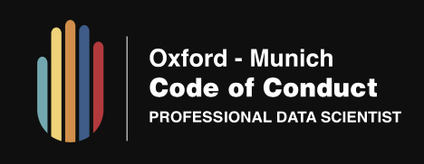
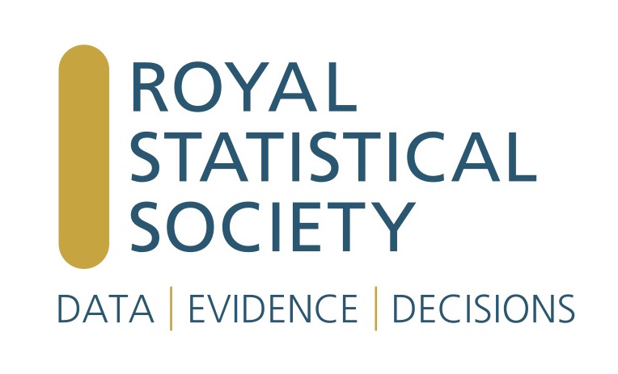

```{r setup, include=FALSE}
knitr::opts_chunk$set(echo = FALSE, fig.align = "center")
```


## Move fast and break things

<center>

```{r echo=FALSE, out.width = "90%"}

```

</center>

## Interconnected and interdependent

<center>

```{r echo=FALSE, out.width = "100%"}

```

</center>


## At the centre of it all

<center>

```{r echo=FALSE, out.width = "50%"}
knitr::include_graphics("Another_slide_deck_files/datascienceimage.png")
```

</center>

*“Data Science is the necessary processing of otherwise overwhelming and messy information to help our tiny human brains make better decisions”.*  
DataKind


## Code of conduct - key features


| Element                         | Details                           | Ethical                                                                                                     |
|---------------------------------|-----------------------------------|-------------------------------------------------------------------------------------------------------------|
| Project and strategic oversight | Needs questions,  exploration     | Embed ethics into the workflow                                                                              |
| Data management                 | Aquire, assess, wrangle           | Engage with ethical bodies: Information Commissioners Office (ICO), Information Security Standard ISO 27001 |
| Analysis                        | Algorithms, prototypes            | Consider potential impact esp. in relation to people, favour explainable models                             |
| Products and delivery           | Deployment, automation, pipelines | Maintain human oversight in implementation of automated solutions                                           |
| Communicate                     | Report, share, disseminate        | Encourage transparent working, communicate with the public and build trust                                  |


## Potential solutions - codes of conduct

```{r echo=FALSE, out.width = "30%"}

```
 
```{r echo=FALSE, out.width = "30%"}

```
  
```{r echo=FALSE, out.width = "30%"}

```


## Conclusion
Voluntary code of conduct

A professional body to represent data science 

The Royal Statistical Society


